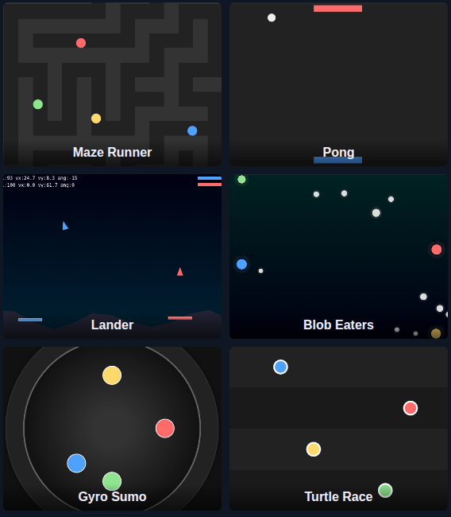

# Gyro Games — local multiplayer phone-as-controller demos


Lightweight local demo that uses phones as motion controllers and a small Python aiohttp server to broadcast motion events to browser game pages. The idea behind this project is to see how old phones can be repurposed as motion controllers for simple local multiplayer games, without requiring any app installation.

## Features

- **Gyro streaming page** (`/gyro.html`) — This page acts as the controller and streams DeviceMotion / DeviceOrientation and acceleration to the server via a WebSocket.

All the games:

- **Maze Runner**
	A multi-player grid maze race. Players tilt their phones to slide through corridors. Includes calibration and orientation-first controls for intuitive steering.

- **Moon Lander**
	2-8 players try to land gently on assigned landing pads. Tilt up for thrust and tilt side-to-side to rotate. Watch your fuel level, since it can run out quickly!

- **Pong**
	Classic paddle-vs-paddle demo — each phone controls a paddle angle or position depending on the mode. Good for quick one-on-one testing.

- **Blob-eat**
	Four-player arena where blobs grow by eating smaller blobs. Includes AI neutrals, display-area smoothing for nicer growth animations, and simple collision/eat rules.

- **Turtle-style racer**
	Small race demos where players 'pedal' by moving the phone. Multiple lane support and finish-line detection make these quick party games.

- **Sumo Arena**
	Small arena where players control their sumo wrestlers to push each other out of the ring. Fun for quick matches and testing balance.

- **Paint**
	Players control paintbrushes to cover the canvas with their color. The goal is to cover as much area as possible while competing against other players.

- **Asteroid Sweepers**
	Players control spaceships to collect floating asteroids. The goal is to gather as many asteroids as possible within a time limit.

- **Blackhole Blaster**
	Players control spaceships and try to hit each other. The goal is to survive as long as possible while dodging the other ships.

Except for Pong which is for 2 players only, all games support up to 8 players.




## Quick start (Linux / macOS)

1. Create & activate a virtual environment (recommended) and install minimal dependencies:

```bash
python3 -m venv venv
source venv/bin/activate
pip install --upgrade pip
pip install aiohttp
pip install cloudflared
```
2. Start the server:

```bash
python3 ./server.py --host 0.0.0.0 --port 8080 --static ./static
```
Now the site should be accessible at localhost:8080.

3. (Optional) Create a .env file with a token to require clients to present the same token when connecting:

I set up a tunnel with cloudflared to expose my local server to the internet so phones can connect without being on the same WiFi. You can also use ngrok or similar services.
```
GYRO_TOKEN=some-secret-token
# Optionally set a public ws_url if you're using a tunnel service
# WS_URL=wss://xxxx.ngrok.io/ws
```

4. Run the server:

```bash
./run.sh
```

5. Open the pages in your browser (or expose the server with ngrok and open the forwarded URL on phones):

- Host machine: http://localhost:8080/ (the server serves `static/index.html`)
- Phone (streamer): http://<your-host>:8080/gyro.html
- Game selector page: http://<your-host>:8080/index.html

How it works (short)
- A phone opens `/gyro.html`, selects a role (blue/red/yellow/green), and starts streaming. The page requests device motion/orientation permissions on iOS and sends compact JSON payloads over WebSocket.
- The server forwards messages to all connected clients. Game pages listen on the same WebSocket and apply incoming telemetry to the matching player role.

Controls & calibration
- Prefer orientation angles (deviceorientation) when available; otherwise the streamer falls back to rotationRate integration.
- `maze.html` contains a small "Calibrate" button (saves neutral orientation to localStorage). Calibration persists across reloads.
- `lander.html` and other game pages include small HUDs and invert toggles to adjust device sign conventions per phone.


## Development notes
- The server is a minimal aiohttp app in `server.py`. It serves files from `static/` and implements `/api/token` and `/ws` endpoints.
- If you get a ModuleNotFoundError for `dotenv`, install `python-dotenv` or remove the `.env` usage in `server.py`.

## Troubleshooting
- WebSocket fails to connect: check server console for handshake logs. If you set `GYRO_TOKEN` then the client must pass the same token (see `/api/token` response). If you see malformed ws URLs like `wss://https//...` check any `WS_URL` you configured.
- iOS motion permission: Safari requires a user gesture to request motion/orientation permission. Open `/gyro.html` and tap Start; if the page doesn't prompt, check the Safari settings and ensure HTTPS/localhost and a user gesture.
- Virtualenv pip wrapper broken: recreate the venv using `python3 -m venv .venv` and reinstall packages with `python -m pip install ...`.

## License & credits
- This project is released under a non-commercial license: Creative Commons
	Attribution-NonCommercial 4.0 International (CC BY-NC 4.0).

	In short: you are free to copy, modify, and redistribute the source code and
	documentation for non-commercial purposes, provided you give proper attribution
	to the original author. Any distribution (including derivative works) must be
	for non-commercial use only. The full license text is available from the
	Creative Commons website and a copy or reference is provided in the `LICENSE` file.

	Key points:
	- You may use, modify and redistribute this project for non-commercial purposes.
	- You must provide attribution to the original project when redistributing.
	- Commercial use (selling, licensing, or redistributing for direct commercial gain)
		is not permitted under this license. For commercial use please contact the project owner
		to arrange a separate commercial license.
	- The software is provided WITHOUT ANY WARRANTY; without even the implied warranty of
		MERCHANTABILITY or FITNESS FOR A PARTICULAR PURPOSE. See the full license for details.

	If you want to use this code commercially or include it in a project that will be
	distributed commercially, please contact the project owner to discuss a commercial
	licensing arrangement.
